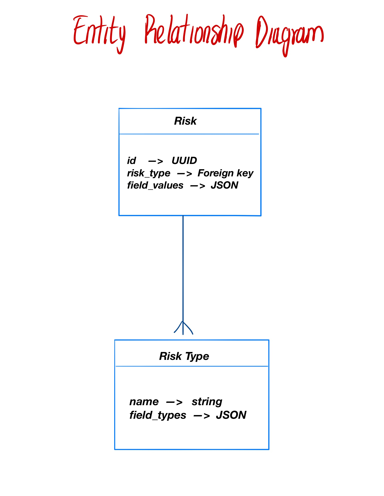

# Milton Lenis | BriteCore Hiring Project

This repository contains my Test Project for the Product Development role at
[BriteCore](https://www.britecore.com/), thank you for taking the time to read this documentation.
If you want me to implement some new feature, fix something or give any further detail don't hesitate on reaching me at miltonln04@gmail.com.

The documentation is divided into different sections explaining the important aspects of the development.


## How to Use The App
To check the deployed version of the project please go [here](http://ec2-13-59-165-204.us-east-2.compute.amazonaws.com/#/create-risk).

When you enter to the application, it redirects you to the **"Create Risk"** page where you can select any **Risk Type** previously
registered to the database via [API Rest](http://ec2-13-59-165-204.us-east-2.compute.amazonaws.com/api/).

Right after you select a **Risk Type**, its fields are loaded to their corresponding widget, then you can fill them and hit the **save button** to create your **Risk**.
When the **Risk** is successfully created, you'll be redirected to the **"List Risks"** page where you can see all of the saved Risks and have the options to see
each one in detail or delete them.


## Data Layer

### Risk Types
Basically, a Risk Type has a name and a set of fields of different types. In order to represent the flexibility of the field types, I decided to implement a PostgreSQL's `JSONField`.

`JSONField` is stable for some years now and it's broadly supported by both **Django** and **Django Rest Framework**, it allows us to not only have any amount of fields we want, but it's also very extensible to add other field features, for example, to do data validation, I'll give an example of this in the end of this section. The Risk Type model could look similar to this:

```python
class RiskType(models.Model):
    name = models.CharField()
    fields_type = JSONField()
```

Where `fields_type` would be a key-pair dictionary with one depth level where each key is a `string` and each value could be the keywords `"STRING"`, `"NUMBER"`, `"DATE"` or a strings-list with options to represent the **ENUM** type (for simplicity): `["OPTION1", "OPTION2",...,"OPTION N"]`. For example, a `RiskType`'s `field_type` value could look like this:

```python
{
    'string_field': 'STRING',
    'number_field': 'NUMBER',
    'date_field': 'DATE',
    'enum_field': ['option1', 'option2', 'option3']
}
```

In order for this to be a robust implementation, a data structure validation will be implemented in the API.

### Risks
We can follow the same principle from Risk Types to represent the values storage in the actual Risk model, the Risk model could look like this:

```python
class Risk(models.Model):
    risk_type = models.ForeignKey(RiskType)
    field_values = JSONField()
```

Where `field_values` would also be a key-pair dictionary where each key is a `string` but also it should be one of the keys from `RiskType`'s `fields_type` field. On the other hand, the values of the dictionary could be the actual Python type of each field, for example, `"STRING"`, `"DATE"` and `"ENUM"` would be `str` and `"NUMBER"` could be represented by `Decimal` for precision. So, according to the previous `RiskType`'s `field_type` value example, its values for a `Risk` could be the following:

```python
{
    'string_field': 'Some string',
    'number_field': 144,
    'date_field': str(timezone.now()),
    'enum_field': 'option1'
}
```

We are going to validate not only that each field name corresponds to its definition in `RiskType` but also that the actual Python types are accomplished, in this case, `RiskType` would be acting not only as a selector, but also as a **Data Validation Layer**.

### Extending This Approach
As I said, with JSON, this data model is super extensible, for example, we could add useful metadata to each field definition, let's show a quick example with `"STRING"`:

```python
{
    "string_field": {
        "type": "STRING",
        "help_text": "Field to introduce string values",
        "max_length": 30
    }
}
```
As we can see, we could define any useful metadata that we could use in the final application

## Entity Relationship Diagram
Whit that data model we end up having this simple database representation, no complex relationships, no multiple tables, just two tables and a foreign key:



## Backend
I implemented a Django project for the backend using Django Rest Framework for the API Rest since they are tools in which I have a lot of experience

### Implemented Features
* Deployment and Production Django settings split using [python-dotenv](https://pypi.org/project/python-dotenv/)
* Risk Types API Rest (Create, Update, Get and Delete)
* Risks API Rest (Create, Update, Get and Delete)
* Used ViewSets (Equivalent to Class Based Views) for all API Views
* Unit Tests for all the endpoints of the API Rest and some edge cases
* Validation layer on Risk Types fields structure and Risks field types
* Used frontend staticfile bundles with Django Webpack Loader for easy deploying

### Dependencies
* Python [3.6] (Python Version)
* Django [2.1.7] (Backend Language)
* Django Rest Framework [3.9.1] (API Rest)
* Django Webpack Loader [0.6.0] (Staticfile Bundles)
* PostgreSQL [10.6] (Database)
* Python Dotenv [0.10.1] (Environment Variables)
* Django PDB [0.6.2] (Debugging)
* Virtual Env (Virtual Environments)


## Frontend
*Disclaimer: This was my very first time implementing a VueJS application, I have experience working with ReactJS, they have some major syntax differences, but it turns out I find very interesting VueJS and I'm excited to continue learning it*

### Implemented Features
* Used a VueJS template for better look and feel.
* API Rest Consuming using Axios client
* Application routing with Vue Router
* Risks Creation with a simple validation layer checking that a **Risk Type** is selected and all the fields are filled before saving
* Risks Listing
* Risk Detail
* Delete Risk

### Dependencies
* VueJS [2.6.3] (Frontend Framework)
* Vue CLI [3.4.0] (VueJS CLI Scaffolder)
* Vue Material [1.0.0-beta-8] (Package for the template)
* Vue Router [3.0.2] (Route Handling)
* Axios [0.18.0] (API Consuming)
* Webpack Bundle Tracker [0.4.2-beta] (Webpack Compilation Stats used by Django)
* SASS [CSS Framework]


## Deployment
Deployed to an AWS EC2 Instance using:

* Nginx (Web Server)
* Gunicorn (WSGI Interface)
* Supervisor (Process Manager)
* SSH (Key Access)
* Firewall allowing only SSH and HTTP


## Installation
Assuming you are using Ubuntu and you have the repository cloned already

### Frontend Installation
1) Install NodeJS and npm -> `sudo apt-get update && sudo apt-get install nodejs npm`
2) `cd britecore_test_project/frontend`
3) Run `npm install` to install frontend dependencies
4) Run `npm run build` to compile the statics and create `webpack-stats.json`

### Backend Installation
1) Make sure you have **Python 3.6+** installed on your machine
2) `cd britecore_test_project/backend`
3) Create a virtual env -> `python3 -m venv venv/`
4) Install dependencies -> `pip install -r requirements.txt`
5) Create a `secrets.env` file inside `backend/env` using `secrets.env.default` as template
6) Create a PostgreSQL user and DB with your credentials from `secrets.env`
7) Migrate the database -> `python manage.py migrate`
8) Collect static files (This will include frontend bundles) -> `python manage.py collectstatic`


## Quiz File
[Here](quiz.py) is the file that I used to solve the debugging quiz


## Closing
Thanks for reading this far, I wish you a good day and I'm very looking forward to an interview with you.